# Frontend Mentor - Single price grid component solution

This is a solution to the [Single price grid component challenge on Frontend Mentor](https://www.frontendmentor.io/challenges/single-price-grid-component-5ce41129d0ff452fec5abbbc). Frontend Mentor challenges help you improve your coding skills by building realistic projects.

## Table of contents

- [Overview](#overview)
  - [The challenge](#the-challenge)
  - [Screenshot](#screenshot)
  - [Links](#links)
- [My process](#my-process)
  - [Built with](#built-with)
  - [What I learned](#what-i-learned)
  - [Continued development](#continued-development)
  - [Useful resources](#useful-resources)
- [Author](#author)
- [Acknowledgments](#acknowledgments)

## Overview

### The challenge

Estimated completion time: 8hrs

Completion time: 5:40

Users should be able to:

- View the optimal layout for the component depending on their device's screen size
- See a hover state on desktop for the Sign Up call-to-action

### Screenshot

#### HTML

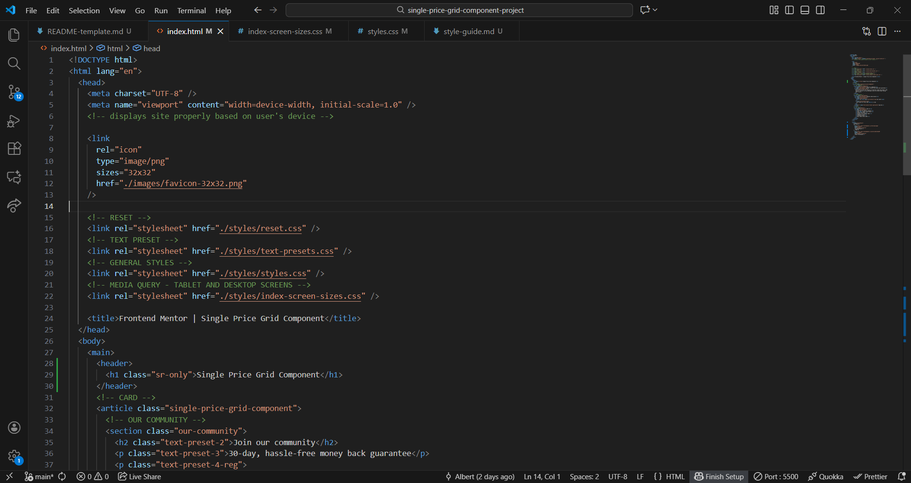
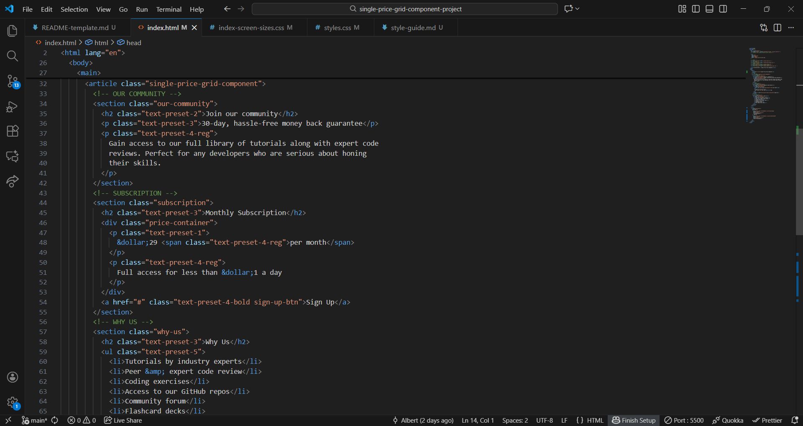


#### CSS - RESET

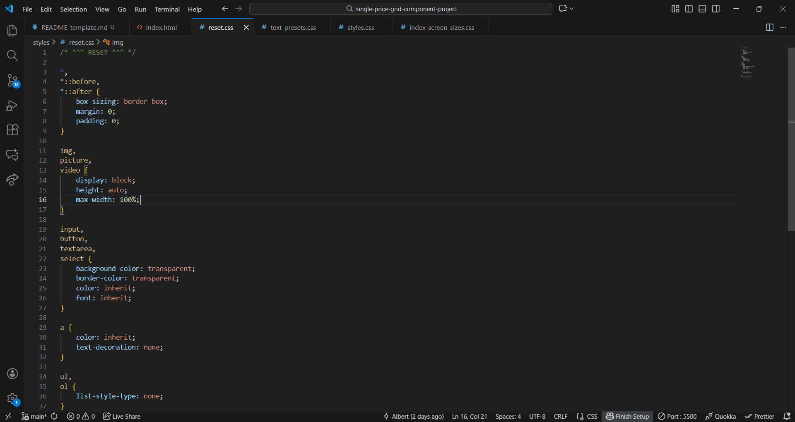

#### CSS - TEXT PRESETS

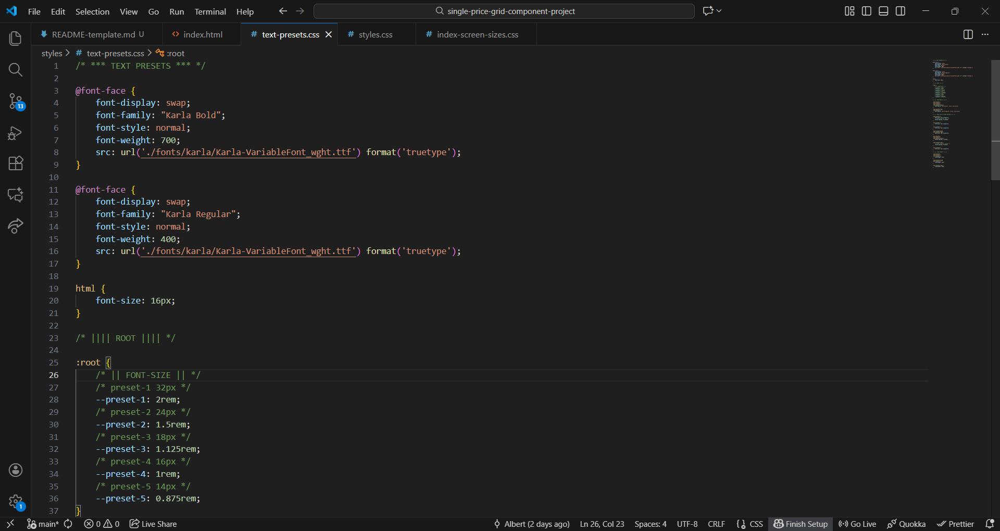
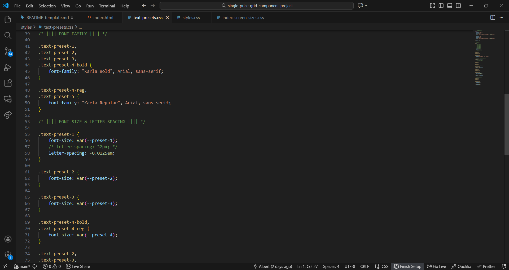
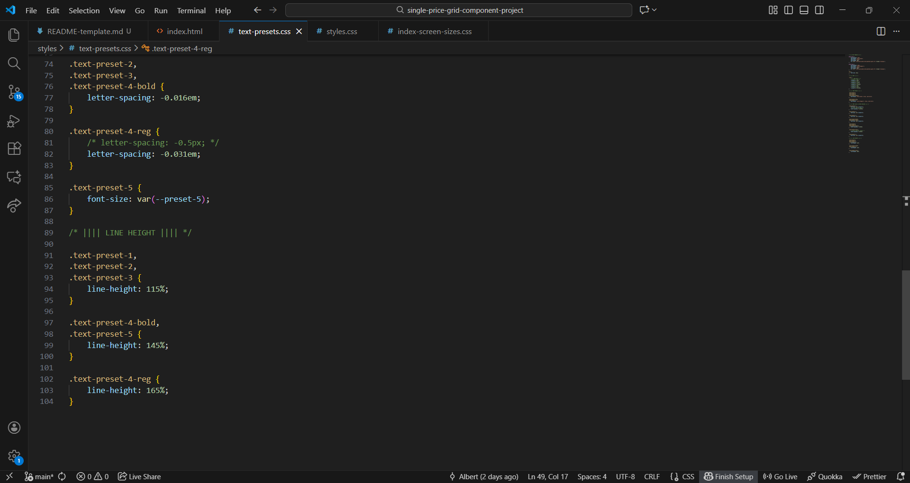

#### CSS - MAIN (STYLES)

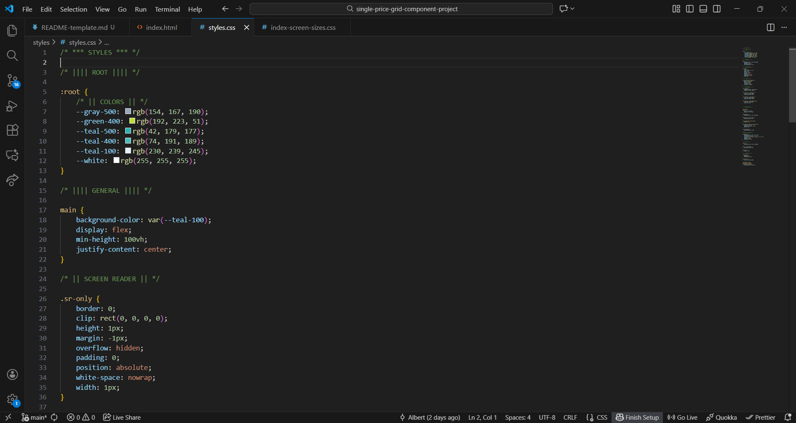
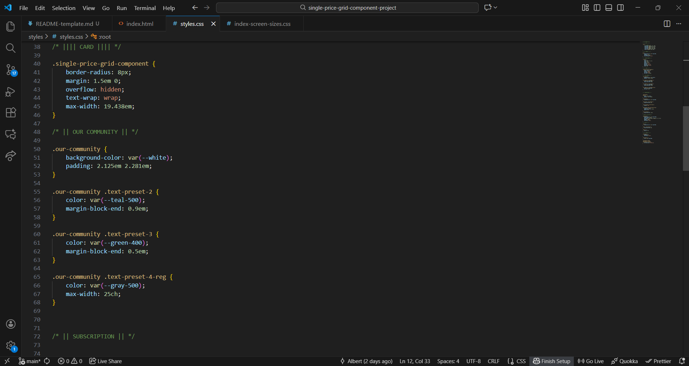
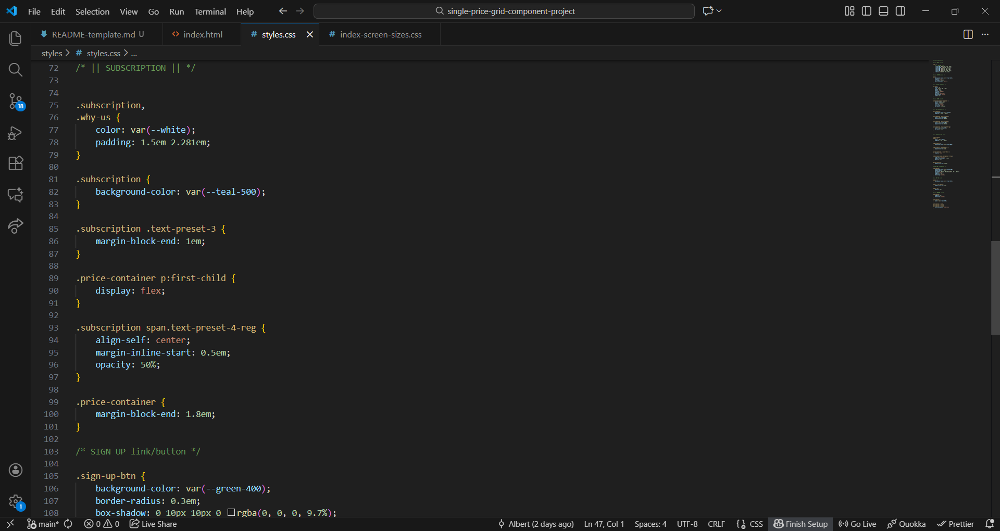
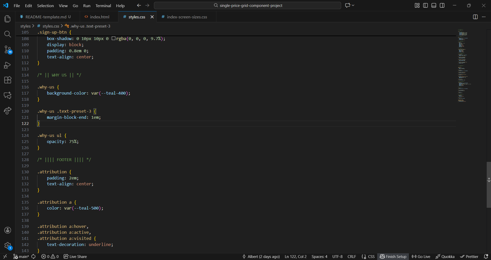

#### CSS MEDIA QUERY (SCREEN SIZES)

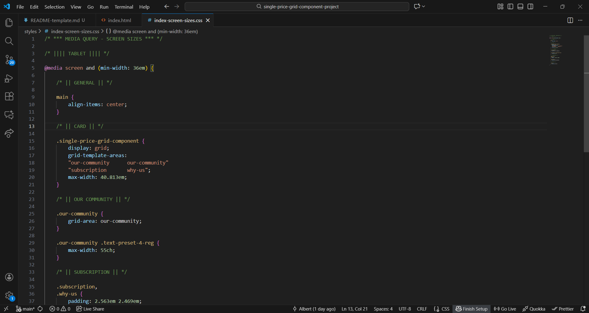
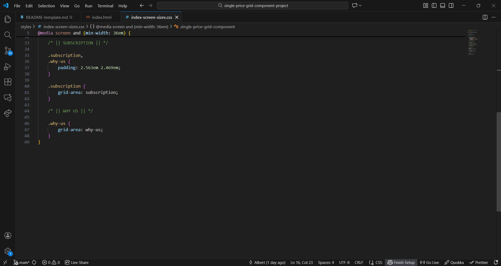

### Links

- Solution URL: [Github @BertSki90](https://github.com/BertSki90/single-price-grid-component)
- Live Site URL: [Github Pages @BertSki90](https://bertski90.github.io/single-price-grid-component/)

## My process

### Built with

- Semantic HTML5 markup
- CSS custom properties
- Flexbox
- CSS Grid
- Mobile-first workflow

### What I learned

This is the second, maybe third, time using grid. I find using the "grid-template-areas" and "grid-name" properties extremely helpful. I implemented the grid display when the screen becomes tablet size. See below:

To see how you can add code snippets, see below:

```html
<article class="single-price-grid-component">
  <!-- OUR COMMUNITY -->
  <section class="our-community">
    <!-- .:code:. -->
  </section>
  <!-- SUBSCRIPTION -->
  <section class="subscription">
    <!-- .:code:. -->
  </section>
  <!-- WHY US -->
  <section class="why-us">
    <!-- .:code:. -->
  </section>
</article>
```

```css
/* || CARD || */

.single-price-grid-component {
  display: grid;
  grid-template-areas:
    "our-community      our-community"
    "subscription       why-us";
  max-width: 40.813em;
}

/* || OUR COMMUNITY || */

.our-community {
  grid-area: our-community;
}

/* || SUBSCRIPTION || */

.subscription {
  grid-area: subscription;
}

/* || WHY US || */

.why-us {
  grid-area: why-us;
}
```

### Continued development

I am excited for future reposive grid projects that utilize more css grid properties to advance my skills with working in the grid displays.

### Useful resources

- Looked up various CSS properties on google.

## Author

- Website - [Github Profile @BertSki90](https://github.com/BertSki90)
- Frontend Mentor - [@BertSki90](https://www.frontendmentor.io/profile/BertSki90)
- X - [@BertSki90](https://x.com/BertSki90)

## Acknowledgments

Thank you to the entire community! I recieve valuable knowledge from everybodys input. Frontend Mentor and FreeCodeCamp have created great communitites and are great places for coding information.
